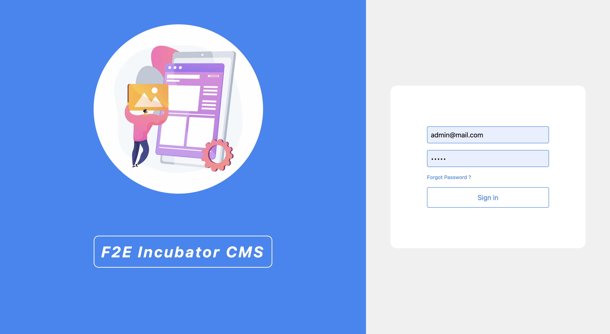
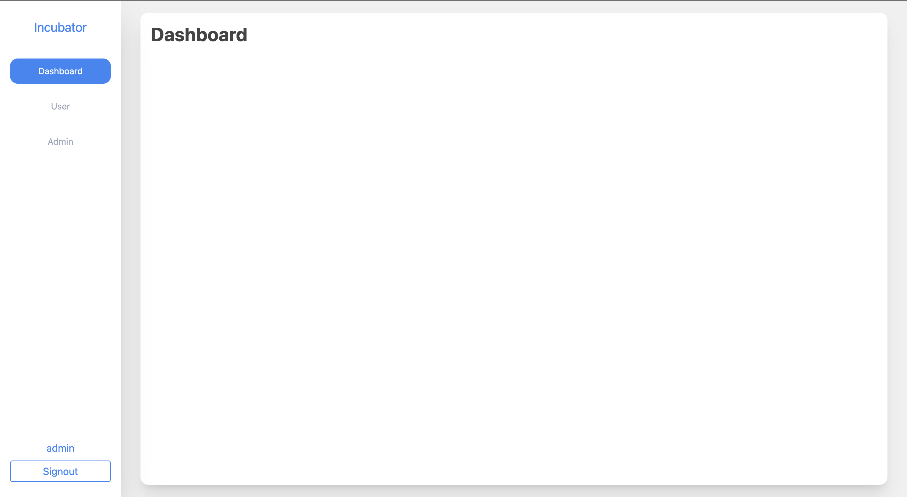

# Web Template CMS

This is a template project clone from [`dannyisadog/web-template`](https://github.com/dannyisadog/web-template).




# Features
- [next.js](https://nextjs.org/)
- [typescript](https://www.typescriptlang.org/)
- [next-auth](https://next-auth.js.org/)
- [prisma](https://www.prisma.io/)
- [tailwindcss](https://tailwindcss.com/)

# Prerequisites

- [docker](https://www.docker.com/)
- [make](https://linuxhint.com/install-use-make-windows/)

# Getting Started

1. create .env file

```bash
cp .env.example .env
```

2. fill up basic info to .env

```
APP_NAME=YOUR_APP_NAME

# openssl rand -base64 32
NEXTAUTH_SECRET=
```

3. setup environment

```bash
make setup
```

4. up service

```bash
make up
```

5. check logs

```bash
make logs
```

6. access web

```
http://localhost:3000
```

7. check mail sent

```
http://localhost:8025
```

8. API documentation

```
http://localhost:8080
```